<!--
**mengqiuleo/mengqiuleo** is a ✨ _special_ ✨ repository because its `README.md` (this file) appears on your GitHub profile.

### Hi here is xiaoy 👋

Here are some ideas to get you started:

- 🔭 I’m currently working on ...
- 🌱 I’m currently learning ...
- 👯 I’m looking to collaborate on ...
- 🤔 I’m looking for help with ...
- 💬 Ask me about ...
- 📫 How to reach me: ...
- 😄 Pronouns: ...
- ⚡ Fun fact: ...

  

   
A Sometimes passion ✨ and sometimes idle 🥋 frontend developer from China 👨‍💻

-->
<!-- 标题 + 个人描述, emoji 取自: http://emojihomepage.com -->

  <h1 height="200px" align="center">
    Hi , here is xiaoy
  </h1>
   <strong>
🌱 一枚前端
</strong>

<!-- 
  技术栈标签, 小标签来自: https://shields.io/
  1. shields 链接格式: https://img.shields.io/badge/-{标签文本}-{标签背景色}?style={标签类型}&logo={标签前面 Logo}&logoColor={Logo 颜色}
  2. shields 可选 Logo 列表参考: https://github.com/simple-icons/simple-icons/blob/develop/slugs.md
-->

  
  
  
  
  
  
  

  
  
  
  

<!--

<h2 height="200px" align="center">Hi here is xiaoy </h2>
<h2 align="center">A passionate frontend developer from China</h3>
-->

 

  

<!--

  
  
  
  

  
  
  

  
  
  
  
   
   
   

-->

 

## something about me

- 📫 wx: real-pjyOwO  qq: 1003346758
- ⚡ [xiaoy's blog](https://mengqiuleo.github.io/)
 

~~24届准前端开发工程师~~ 
   有点失望

<!--

-->

 

<!-- 贪吃蛇 - 图片有 actions/Generate Snake 定时生成 -->
<!-- 
<picture>
  <source media="(prefers-color-scheme: dark)" srcset="./assets/github-snake-dark.svg" />
  <source media="(prefers-color-scheme: light)" srcset="./assets/github-snake.svg" />
  
</picture>
-->

